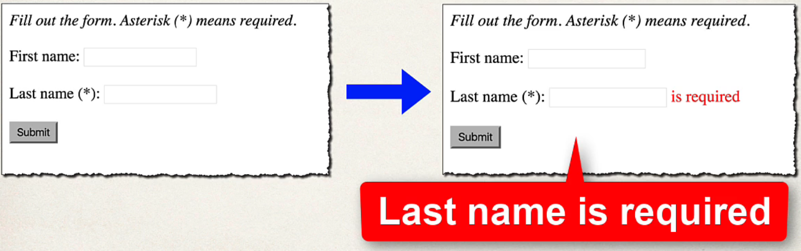
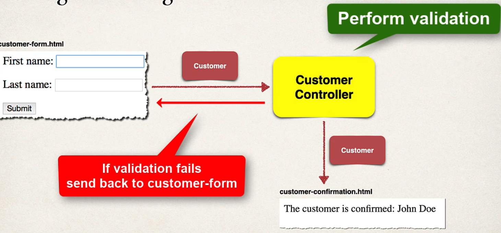

## 205. Spring Boot - Spring MVC Validation - Required Fields - Overview

### Required Fields


### Pulling it All Together 


### Development Process 
1. Create Customer class and add validation rules 
2. Add Controller code to show HTML form 
3. Develop HTML form and add validation support 
4. Perform validation in the Controller class 
5. Create confirmation page


#### Step 1: Create Cutermer class and add validation ruels 

```java
public class Cusotmer {
    @NotNull(message = "is required")
    @Size(min=1, message = "is required")
    private String lastName; 
    
    // getters / setters
}
```

#### Step 2 : add Controller code to show HTML form 
```java
@Controller
public class CustomerController {
    
    @GetMapping("/")
    public String showForm (Model theModel) {
        theModel.addAttribute("customer", new Customer()); 
        
        return "customer-form"; 
    }
}
```

#### Step 3 : Develop HTML form and add validation support 
```html
<form th:action="@{/processFrom}" th:object="${customer}" method="POST">
    
    <span th:if="${#fields.hasError('LastName')}"
          th:errors="*{lastName}"
          class="error"></span>
</form>
```

#### Step 4 : perform validaiton in controller class 
```java
@PostMapping("/processForm")
public String processFrom(
        @Valid @ModlAttribute("customer") Customer theCustomer, 
        BindingResult theBindingResult) {
    if(theBindingResult.hasErrors()) {
        return "customer-form";
    } else {
        return "customer-confirmation"; 
    }
}

```
* `@Valid ` tell the spring perform validaiton 
* theBindingResult : the result of validation 


#### Step 5 : Create confirmation page 
