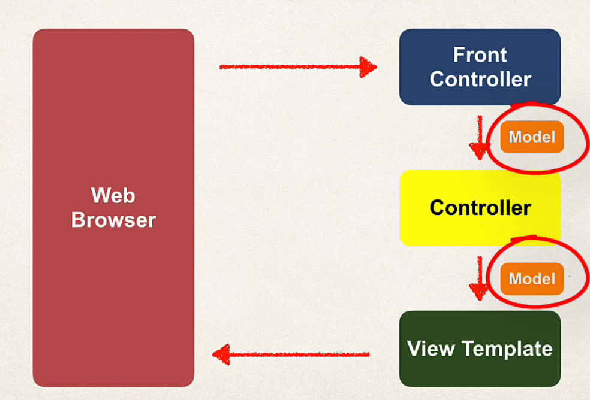

## 182. Spring Boot - Adding Data to Spring MVC Model - Overview

### Focus on the Model


### Spring Model  
1. The **Model** is a container for your applicatin data
2. In your Controller 
   * you can put anyhting in the model 
   * stirngs , objects , info form database, etc
3. you view page can access data from the model 

### Code example 
* We want to create a new method to process form data
* Read the form data: student's name 
* Convert the name to upper case 
* add the uppercase version to the model 

#### Passing Model to your controller 
```java
@RequestMapping("/porcessFromVersionTwo")
public String letsShoutDude(HttpServletRequest request, Model model) {
    // read the request parameter from the HTML form 
    String theName = request.getParameter("studentName");
    
    // convert the data to all caps 
    theName = theName.toUpperCase();
    
    // create the message 
    String result = "Yo!" + theName;
    
    // add message to the model 
    model.addAttribute("result", result);
```

* `HttpServletRequest` to read the form data 
* `Model` container to your data
* `theName` field, get the typed in form in field `studentName`
* process the `theName`
* add the processed name to the **model** 

#### Adding more data to the model 
```java
String reuslt = ...
List<Student> theStudentsList = 
ShoppingCars ....

// add data to the model 
model.addAttribute ("message ",reuslt)
model.addAttribute ("students",theStudentsList)
model.addAttribute ("shoppingCart ",)
```
