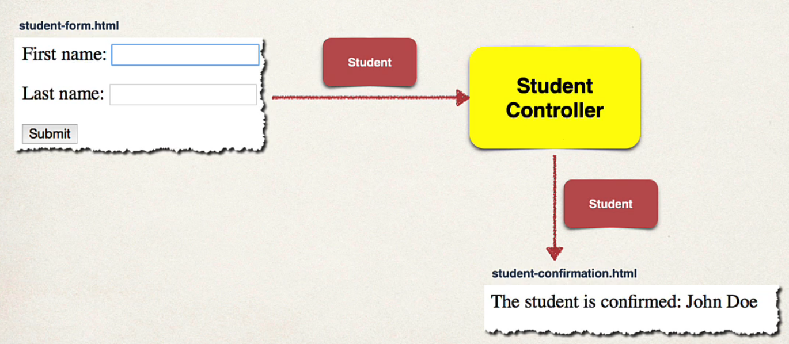
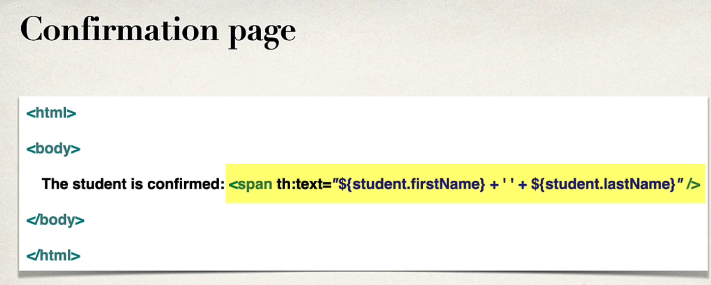

## 190. Spring Boot - Spring MVC Form Data Binding - Text Fields - Overview

### Spring MVC Form Tag - Text Field 

### Review HTML Froms 
* HTML Froms are used to get input form the user 


### Data binding 
* Spring MVC forms can make use of data binding 
* Automatically setting /reriteving data from a Java Object / bean 

### Big Picture 


### Showing From 
in your spring controller 
* befroe you show the form, you must addd a model attribute 
* This is a bean that will hold form data for the **data binding** 


### Showing From - Add model Attribute 
```java
@GetMapping("/showStudentForm")
public String showForm(Model theModel) {
    theModel.addAttribute("student", new Student());
    return "student-form";
}
```

### Setting up HTML Form - Data Binding 
```html
<form th:action="@{/processStudentFrom}" th:object="${student}" method="POST">
    First name: <input type="text" th:field="*{firstName}"/>
    Last  name: <input type="text" th:field="*{lastName}"/>
   
    <input type="submit" value="Submit"/>
    
</form>
```
*  `*` is shortcut syntax for `${student.firstName}`

#### When form is Loaded ... fields are populated : 
* when form is **loaded**  
spring MVC wil read student  
from the model,  
then call:  
```java
student.getFirstName();
...
student.getLastName();
```

#### When form is submitted ... calls setter methods 
when form is submitted 
spring MVC will create a new Student instance andd add to the model, then call: 
```java
student.setFirstName()
student.setLastName() 
```

#### Handling Form submission in the Controller 
Code snippet from Controller 
```java
@PostMapping("/processStudentForm")
public String processForm(@ModelAttribute("student") Student theStudent) {
    // log the input data
    System.out.println("The student" + theStudent.getFirstName() + " " + theStudent.getLastName());
    
    return "student-confirmation"; 
}
```

### Confirmation Page


### Development Process 
1. Create Student class
2. Create Student controller class 
3. Create HTML form 
4. Creat form processing code
5. Create confirmation page 
