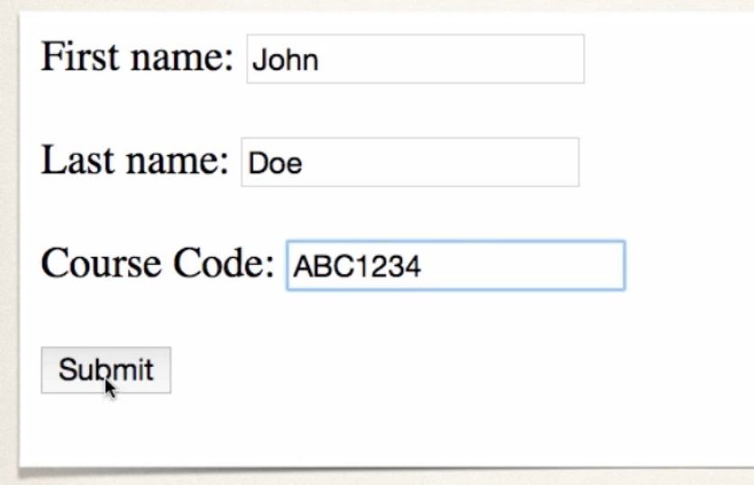

## 220. Spring Boot - Spring MVC Validation - Custom Validation - Overview - Part 1

### Custom vlaidation demo 


* perform vustom validiaton based on businesss urles 
  * oru example : course codem ust start with `LUV`
* Spring MVC calls our cutom validation 
* custom validation returns boolean value for pass /fail (true/fasle)

#### Create a custom java annotation ... from scratch 
* So far, we've used predefined validation rules : `@Main, @Max`
* for cutom validation ... we will creat ea **Custom Java Annotation**
  * @CourseCode

```java
@CourseCode(value="LUV", message="must start with LUV")
private String courseCode; 
```

### Development process 
1. Create custom validation rule 
2. add validation rule to Customer class 
3. Display error message on HTML form 
4. Update confirmation page 

#### Step 1 :  Create custom validation rule 
* create `@CourseCdoe` annotation 
* Create `CourseCodeConstraintValidator` 
