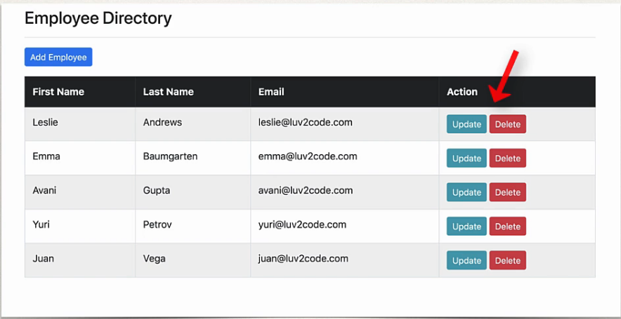
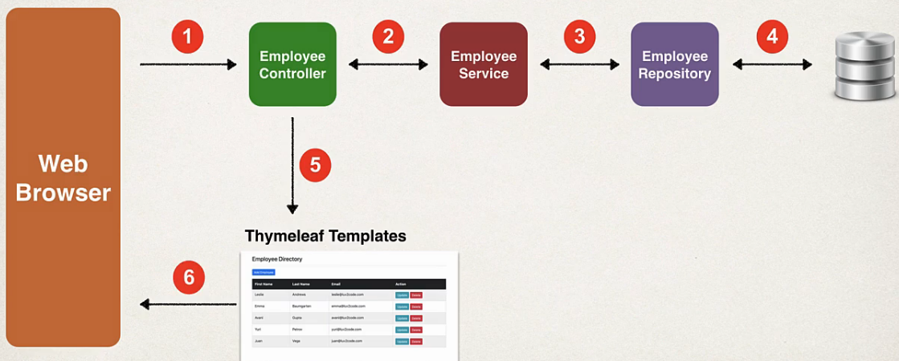
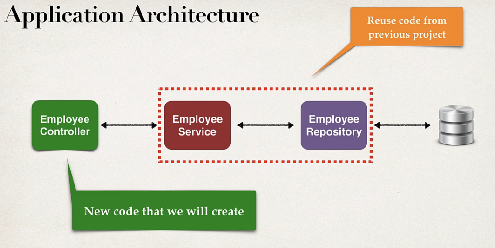

## 227. CRUD Database Project - Overview

### Applicaiton Requirements
1. Create a Web UI for the Employee Directory 
2. User should be able to 
   * Get a list of employees 
   * add a new employee
   * update an employee 
   * delete an employee 

#### Application Architecture : 

### Project Set Up
* We will extend our existing Employee project and add DB integration 
* Add **EmployeeService, EmployeeRepository** and **Employee** entity
  * Available in one of our previous projects 
  * we created all of this code already from scratch ... so we'll just copy/paste it 
* Allows us to focus on creating **EmployeeController** and Thymeleaf templates

