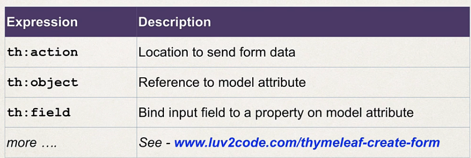
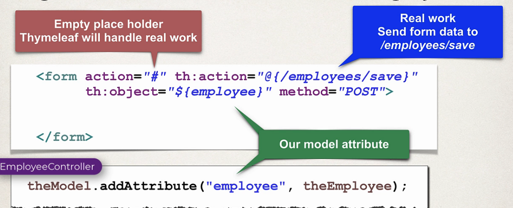

## 233. CRUD Database Project - Add Employees - Overview

#### Add Employee - DEMO 

1. when click on `add employee`
2. show form 
   * first name 
   * last name 
   * email 
   * save button


### The process
#### Step 1 : add employee button 

```html
<a href="@{/employees/showFormForAdd}"
class="btn btn-primary btn-sm mb-3">Add Employee</a>
```
#### Step 2 : create html form 
before showing the form , **add model for databinding**
```java
public String showFormForAdd(model theModel) {
    // creat emodel attribute to bind form data 
    Employee theEmployee = new Employee(); 
    
    theModel.addAttribute("employee", theEmployee); 

    return "employees/employee-form";
}
```



```html
<form action="#" th:action="@{/employees/save}"
        th:object="${employee}" method="POST">
    <input class="form-control mb-4 w-25" type="text" th:field="*{firstName}" placeholder="First Name">
    <input class="form-control mb-4 w-25" type="text" th:field="*{lastName}" placeholder="Last name">
    <input class="form-control mb-4 w-25" type="text" th:field="*{email}" placeholder="Email">
    <button class="btn btn-info col-2" type="submit">Save</button>
</form>
```
#### Step 3 : process form data to save employee 
```java
public class EmployeeController {
    
    @PostMapping("/save")
    public String saveEmployee(@ModelAttribute("employee") Employee theEmployee) {
        // save the employee 
        employseService.save(theEmployee);
        
        // use a redirect to prevent duplicate submissions 
        return "redirect:/employees/list"; 
    }
}
```
