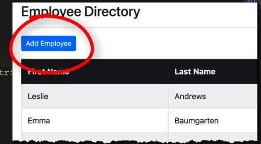

## 234. CRUD Database Project - Add Employee - Coding - Part 1

### The process
1. move to resources/emplates
2. create new folder `employees`
3. create new file `list-employees.html`
4. minor refoctor to `controller`
```java
@GetMapping("/list")
public String getListOfEmployees(Model theModel) {

    // get list from db
    List<Employee> employees = employeeService.findAll();

    // add list to model
    theModel.addAttribute("employees", employees);

    return "employees/list-employees";
}
```
5. run the application 
6. move to browser `localhost:8080/employees/list`

#### Ste p1 : add new Employee button 
1. just above the table 
2. 
```html

<a th:href="@{/employees/showFromForAdd}" class="btn btn-primary btn-sm mb-3">Add Employee</a>
```
3. run the applicaiton, and check the button 

