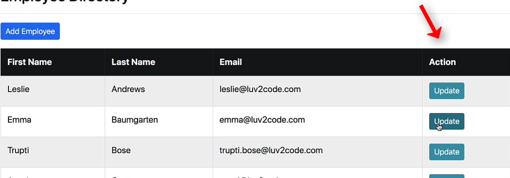

## 237. CRUD Database Project - Update Employee - Overview


### Update employee demo 



1. "Update" button 
2. pre-populate the from 
3. process the form 


#### Step 1  "Update" button 
each row has the button 
* Update button includes employee id 
```html
<a th:href="@{/employees/showFromForUpdate(employeeId=${tempEmployee.id})}"></a>
```

#### Step 2: pre-populate form 
```java
@GetMapping("/showFormForUpdate")
public String showFormForUpdate(@RequestParam("employeeId") int theId) {
    
    // get the employee from the service 
    Employee theEmployee = employeeService.findById(theId); 
    
    // set employee as a model attribute to pre-populate the form 
    theMode.addAtrribute("employee", theEmployee);
    
    // send over to our form 
    return "employees/employee-form"; 
}
```

* when the form is loaded, **getters** methods are called 


```html
<form action="#" th:action="@{/employees/save}"
          th:object="${employee}" method="POST">
        <input type="hidden" th:field="*{id}">
        <input type="text" th:field="*{firstName}" class="form-control mb-4 w-25" placeholder="First Name">
        <input type="text" th:field="*{lastName}" class="form-control mb-4 w-25" placeholder="Last Name">
        <input type="text" th:field="*{email}" class="form-control mb-4 w-25" placeholder="Email">

        <button type="submit" class="btn btn-info col-2">Save</button>
    </form>
```

#### Step 3 : process form data to save employee 

* simply without adding additional code 
* using `save` method 
  * /employees/save 

