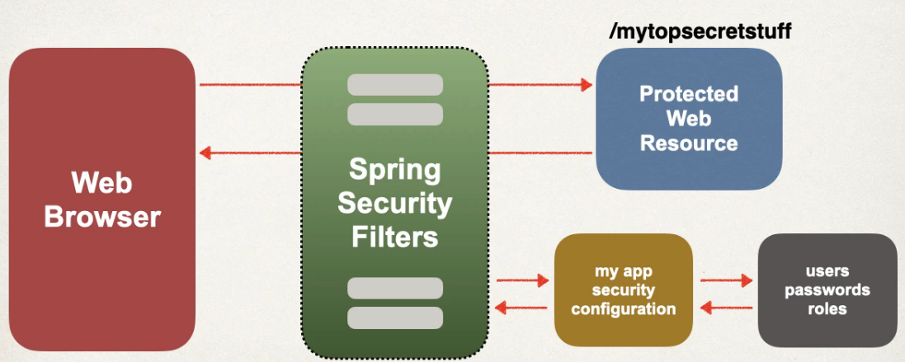
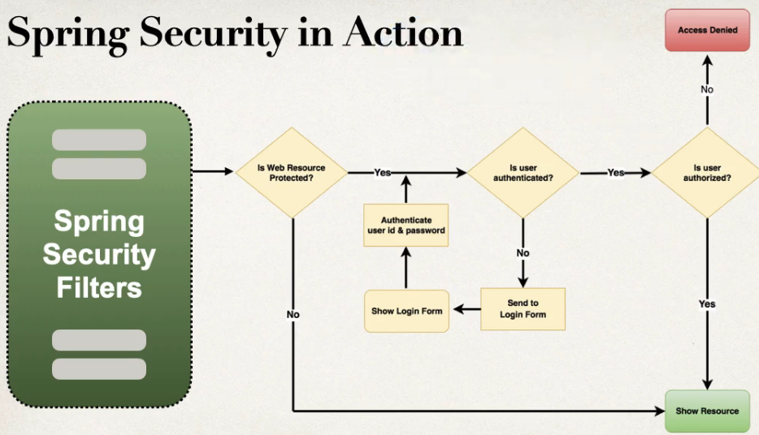
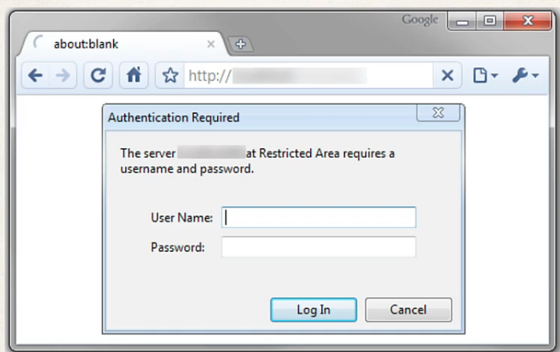
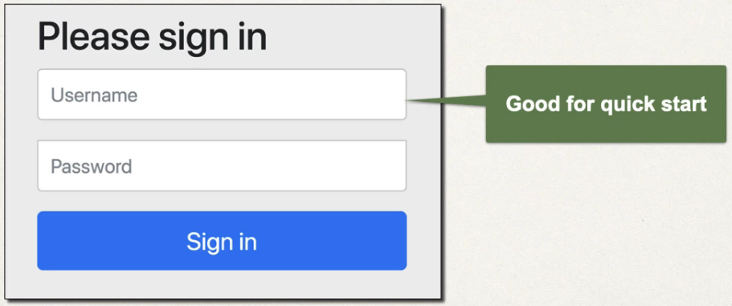

## 241. Spring MVC Security - Overview

### You will learn how to : 
* Secure Spring MVC WEb Apps 
* Develop login pages (default and custom)
* Define users and roles with simple authentication 
* Protect URLs based on role 
* Hide/show content based on role 
* Store users, passwords and roles in DB (plain-text -> encrypted)

#### Practical results 
* cover the omst common Spring Security tasks that you will need on daily projects
* NOt an A to Z reference ... for that you can see **Spring Security Reference Manual** 
  * [luv2code.com/spring-security-reference-manual](luv2code.com/spring-security-reference-manual)

#### Spring Secuiry Model 
* Spring Security defines a framework for security 
* implemented using Servlet filters in the background 
* Two methods of securing an app: declarative and programmatic

#### Spring Security with Servlet Filters 
* Servlet Filters are used to pre-process / post-process web requests 
* Servlet Filters can route web requests based on security logic 
* Spring provides a bulk of security functionality with servlet filters 

### Spring Security Overview 

#### Spring Security in Action 

#### Security Concepts 
* Authentication 
* Authorization 

#### Declarative Security 
* Define application's security constraints in configuration 
  * All java config : @Configuration 
* Porvides separation of concerns between application code and security 

#### Programmatic Security 
* Spring Security provices an API for custom applicatoin coding 
* provides greater customization for specific app requirements 

### Enabling Spring Security 
1. edit pom.xml to add spring security dependency 

#### Secured Endppoints 
* Now when you access your application 
* Spring Security will prompt for login 

#### Different Login Methods 
* HTTP basic Authentication 
* Default login form 
  * Spring Security provides a default login form 
* Custom login form 
  * you own look-and-feel, HTML + CSS 

##### HTTP basic Authentication 

##### defualt login form 

