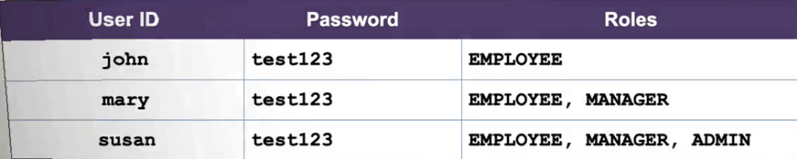

## 246. Spring MVC Security - Basic Configuration - Overview

### Our Users 


### Development Process : 
1. Create Spring Security Configuration(@Configuration)
2. Add users, passwords and roles 

#### Step 1 : Create Spring Security Configuration 
_file :DemoDecurityConfig.java_
```java
@Configuration 
public class DemoDecurityConfig {
    
    // add our security configration here ...
}
```

##### Spring Security Password Storage 
* in Spring Security, passwods are stored using a specific foramt
  * `{id}encodedPassword`  


##### Password Example : 


#### Step 2 : Add useres, passwrods and roles 
```java
@Configuration 
public class DemoDecurityConfig {
    
    // add our security configration here ...
    @Bean
    public InMemoryUserDetailsManager userDetailsManager() {
        UserDetails john = User.builder()
                .username("john")
                .password("{noop}test123")
                .roles("EMPLOYEE")
                .build();
        
        UserDetails mary = User.builder()
                .username("mary")
                .password("{noop}test123")
                .roles("EMPLOYEE", "MANAGER")
                .build();
        
        UserDetails suzan = User.builder()
                .username("suzan")
                .password("{noop}test123")
                .roles("EMPLOYEE", "MANAGER", "ADMIN")
                .build();

    }
}
```

**We will add DB support in later videos** 
