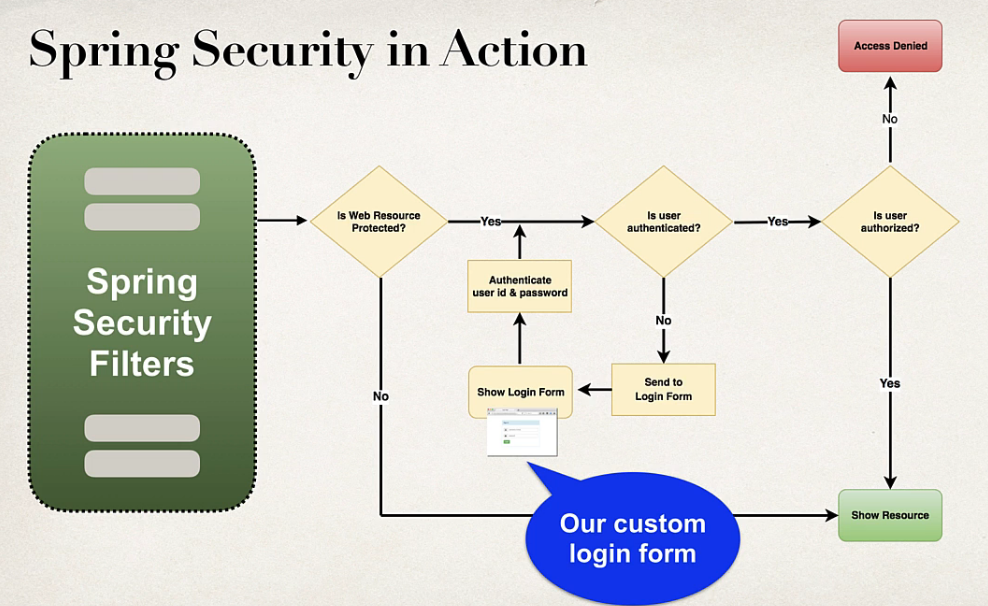
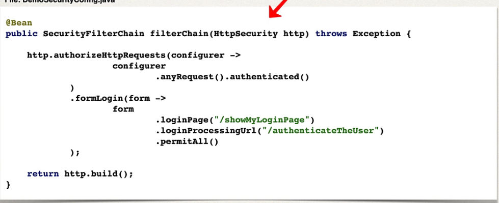

## 248. Spring MVC Security - Custom Login Form - Overview - Part 1

### Spring Security - Default Login Form 


### Development Process 
1. Modify Spring security configuration to reference custom login form
2. develop a controller to show the custom login form 
3. Create custom login form 
   * html, css ...

#### Step 1 : Modify Spring Security Configuration 


#### Step 2: develop a controller to show the custom login form 
```java
@Controller
public class LoginController {
    @GetMapping("/showMyLoginPage")
    public String showMyLoginPage() {
        return "plain-login"; 
    }
}
```