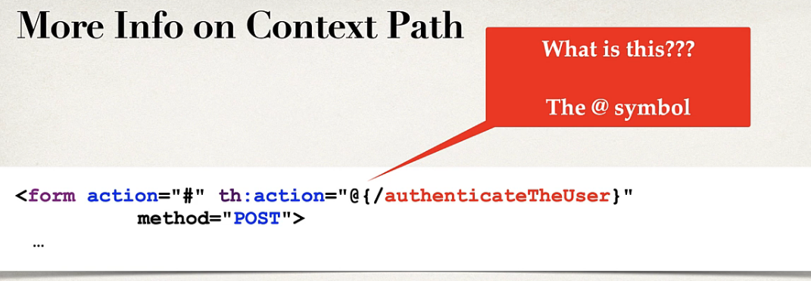

## 249. Spring MVC Security - Custom Login Form - Overview - Part 2

#### Step 3 : Create custom login form 
* send data to login processing URL : **/authenticateTheUser**
* Login processing URL will be handled by Spring security Filters 
* You get it for free ... no coding required 


```html
<form action="" th:action="@{/authenticatedTheUser}" method="POST"></form>
```

* Spring security defined default names for loing form fields : 
  * user name field : `username`
  * passwrod : `passwrod`
```html
user name : <input type="text" name="username">
password : <input type="text" name="password">
```

##### Putting all together : 
```html
<form action="" th:action="@{/authenticatedTheUser}" method="POST">
  user name : <input type="text" name="username">
  password : <input type="text" name="password">
</form>

```

#### More info on Context Path


Context Path is same thins as Context Root 

##### Why use Context Path ? 
* allows us to dynamically reference context path of application 
* htlps to keep links relative to application context path 
* if you change context path of app, then links will still work 
* much better than hard-coding context path 

