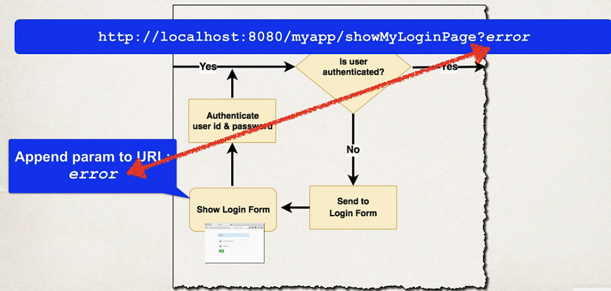

## 253. Spring MVC Security - Login Form Error Message - Overview

#### Failed Login 
* when login fails, by default spring security will ...
* send user back to your login page 
* Append an error parameter **?error**



### Development PRocess 
1. MOdify custom login form 
   1. check the error parameter 
   2. if **error** parameter exists, show an error message 
```html

<form action="">
    <div th:if="${param.error}">
        <i>Sorry! You entered invalid username/password.</i>
    </div>
</form>
```