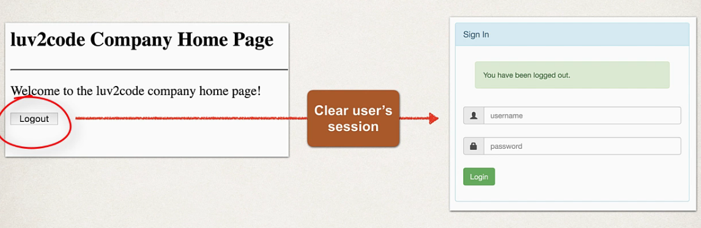

## 257. Spring MVC Security - Logout - Overview

### Logging OUt 



### Development PRocess 
1. Add lagout surrot to Srpring Security Configuration 
2. Add logout button to home page 
3. Update login form to display "logged out" message 

#### Step 1: Add lagout surrot to Srpring Security Configuration 

```java
@Bean 
public SecurityFilterChain filterChain(HttpSecurity http) throws Exception {
    
    http.authorizeHttpRequests(configurer -> configurer.anyRequest().authenticated()).formLogin(form -> form.loginPage("/showMyLoginPage").loginProcessingUrl("/authenticateTheUser").permitAll()).logout(logout -> logout.permitAll()); 
    return http.build; 
}
```

#### Step 2: add logout button 
* Send data to default logout URL: **/logout**
* Logout URL will be handled by Spring Security Filters 
* You get it for free ... no coding requred 

```html
<form action="" th:action="@{/logout}" method="POST">
    <input type="submit" value="Logout"/>
</form>
```

##### Logout Process
* When a lgoout is processed ,by defualt S;ring security will 
* Invalidate user's HTTP session and remove session ocokies , etc
* Send user back to your login page 
* Append a logout paramter **?logout** 

#### Step 3: Update login form to display "logged out" message 
1. Update login form 
   1. check the **loguout** parameter 
   2. if **logout** parameter exists, show "logged out" messag e


```html
<div th:if="${param.logout}">
    <i>You have been logged out.</i>
</div>
```