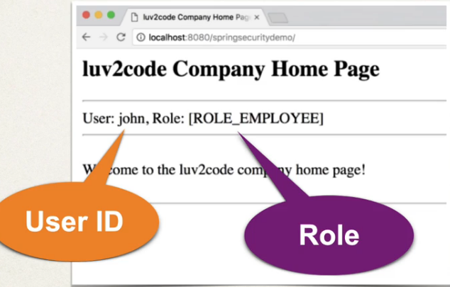

## 259. Spring MVC Security - Display User ID and Roles - Overview

### Display User ID and Roles 



#### Spring Security 
* provides support for accessing user id and roles 

### Development Process 
1. Display the user id
2. display the user roles 

#### Step 1: Display User ID 

```html
User : <span sec:authentication="principal.username"></span>
```
* `"principal.username"` : User ID 
```html
Roles : <span sec:authentication="principal.authorities"></span>
```
* authorities : User roels 

