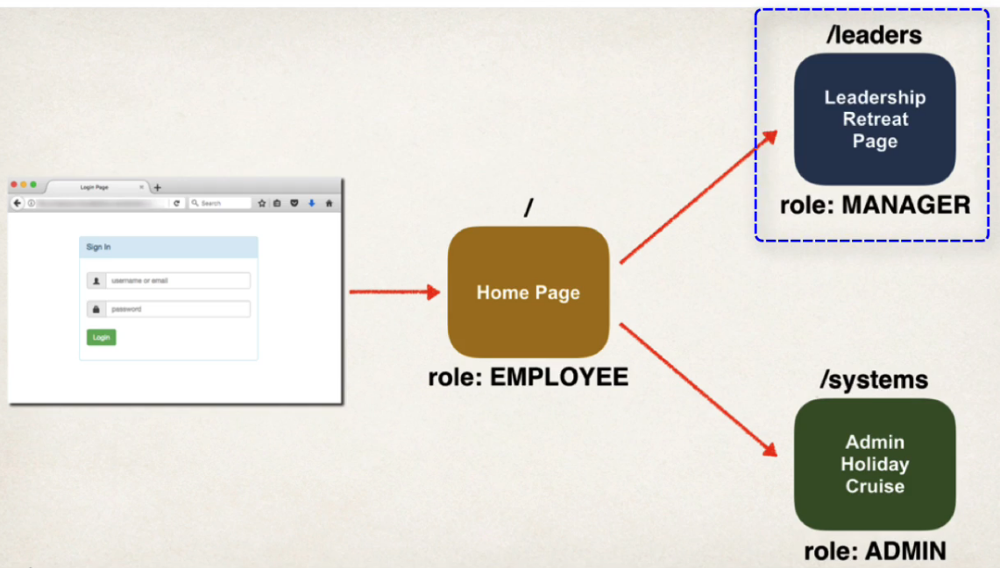
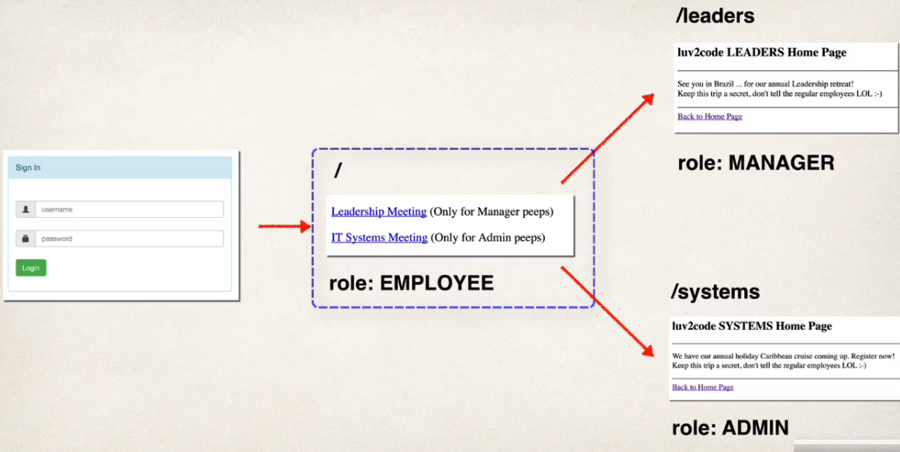

## 262. Spring MVC Security - Restrict URLs Based on Roles - Coding - Part 1




### Development Process 
1. Create supporting controller code nad view pages 
2. Restrict Access based on Roles 


#### Step 1. Create supporting controller code nad view pages 
1. open home page `home.html`
2. update home page: Add a link to point to /leaders
```html

<hr>
<!--add a link to point to /leaders .... this is for the managers-->  
<p>
    <a href="" th:href="@{/leaders}">Leadershipo Meeting</a>
    (Only For manager peeps)
    <a href="" th:href="${}"></a>
    
</p>
```

#### Step 2. Restrict Access based on Roles 