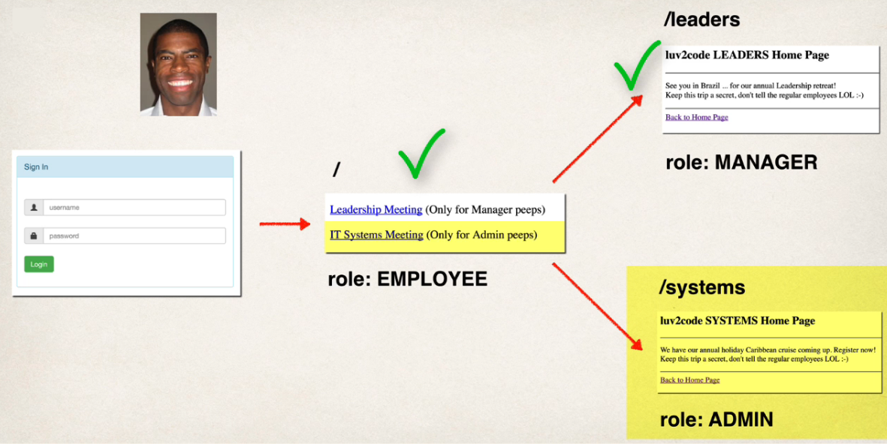

## 265. Spring MVC Security - Restrict URLs Based on Roles - Coding - Part 4



### The process 
1. move to home page 
```html

<!--add a link to point to /systems ... this is for the admins -->

<p>
    <a th:href="@{/systems}"IT Systems Meeting></a>
    (Only for Admin page) 
</p>
```

2. create controller code  
in demo controller 
```java

@GetMapping("/systems")
public String showSystems() {
    return "systems"; 
}
```
3. create `systems.html`

```html

<!DOCTYPE html>
<html xmlns:th="http://www.thymeleaf.org">
<head>
    <meta charset="UTF-8">
    <title>Systems Home Page</title>
</head>
<body>

<p>
    We have annual holliday Caribbean cruise coming up. Rester now!
</p>
<hr>
<a th:href="@{/}">move to home page</a>
</body>
</html>

```
4. run the application and try to login in with all roles cases 

