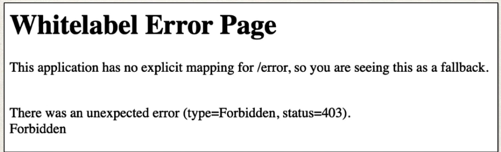
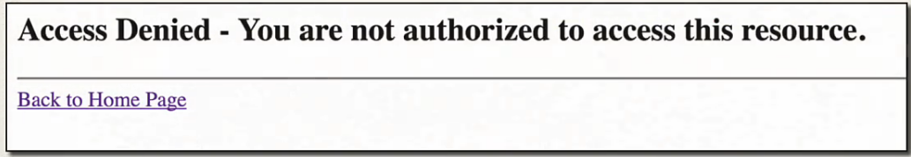

## 266. Spring MVC Security - Custom Access Denied Page - Overview

#### Defualt Access Denied Page 


#### Custom Access Denied Page


### Development Process 
1. Configure custom page for access denied 
2. Create supporting controller code and view page 

#### Step 1. Configure custom page for access denied 
```java
@Bean
    public SecurityFilterChain filterChain(HttpSecurity http) throws Exception {
        http.authorizeHttpRequests(authorize -> authorize
                .requestMatchers("/").hasRole("EMPLOYEE")
                .requestMatchers("leaders/**").hasRole("MANAGER")
                .requestMatchers("systems/**").hasRole("ADMIN")
                .anyRequest()
                .authenticated())
                .formLogin(form ->
                        form.loginPage("/showLoginPage")
                                .loginProcessingUrl("/authenticateTheUser")
                                .permitAll())
                .logout(logout -> logout.permitAll()
            ).exceptionHandling(configurer -> 
                configurer
                        .accessDeniedPage("/access-denied")) ;
        return http.build();
    }
```

#### Step 2. Create supporting controller code and view page 
