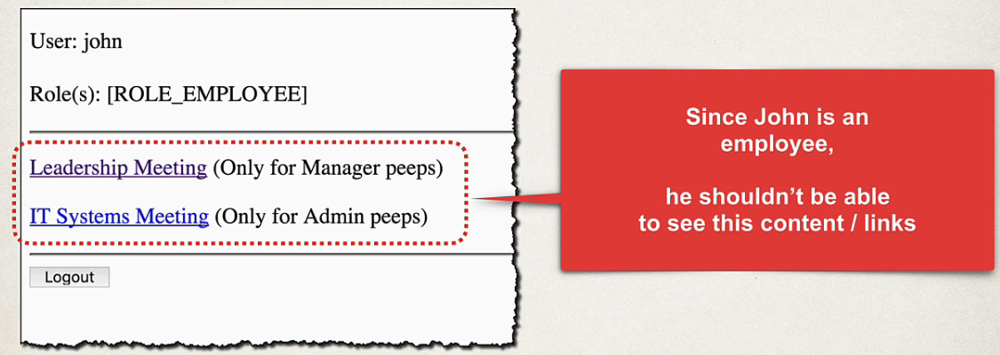

## 269. Spring MVC Security - Display Content Based on Roles - Overview

### Why show these links  ? 


#### Display Content Based on Roles 


#### Spring Security 
```html
<div sec:authorize="hasRole('MANAGER')">
    <p>
        <a th:href="@{/leaders}">
            Leadership Meeting
        </a>
        (Only for Manager peeps)
    </p>
</div>
```