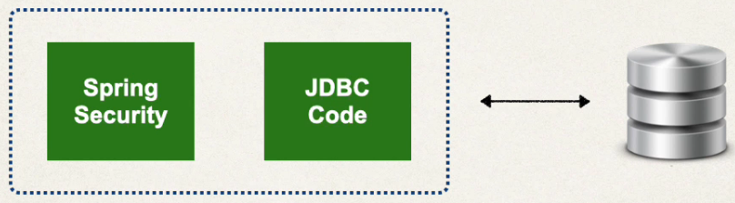
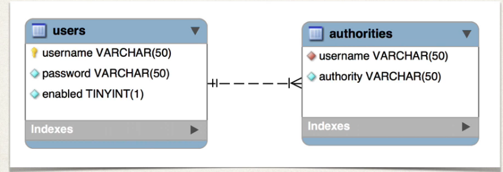

## 272. Spring MVC Security - JDBC Authentication - Plain Text - Overview


### Database Access 
* So far, our user accounts were hard coded in Jav asource code
* we want to add database access 

#### Recal our user roles 
john  :employee 
mary : employee , manage r
susan : employee , manager, admin 


#### Database support in Spring Security 
* Spring security can read user account info from database 
* by default  , you have to follow 

#### Customize Database Access with Spring Security 
* Can also customize the table schemas 
* Useful if you have custom tables specific to you project / custom 
* You will be responsible for developing the code to access the data 
  * JDBC, JPA/HIbernate etc. 

#### Database suppport in spring security 
* follow Spring Security's predefined table schemas 


### Development Process 
1. Develop SQL script to set up database tables 
2. Add database support to Maven POM file 
3. Create JDBC properties file 
4. Update Spring Configuration t ouse JDBC 

#### Defualt spring Security Database Schema 


##### Step 1: Develop SQL script to setup database tables 
```postgresql
CREATE TABLE users
(
    username VARCHAR(50) PRIMARY KEY,
    password VARCHAR(100) NOT NULL,
    enabled  BOOLEAN      NOT NULL
);
```
* insert into users 
```postgresql
-- Insert users into the 'users' table
INSERT INTO users (username, password, enabled)
VALUES ('mary', '{noop}test123', TRUE),
       ('john', '{noop}test123', TRUE),
       ('susan', '{noop}test123', TRUE);
```

* CREATE authorities tale : 
```postgresql
CREATE TABLE authorities (
    username VARCHAR(50) NOT NULL,
    authority VARCHAR(50) NOT NULL,
    CONSTRAINT fk_authorities_users FOREIGN KEY(username) REFERENCES users(username),
    CONSTRAINT pk_authorities PRIMARY KEY (username, authority)
);

```

* insert the authorities 
```postgresql
-- Insert authorities into the 'authorities' table
INSERT INTO authorities (username, authority) VALUES
('john',  'EMPLOYEE'),

('mary',  'EMPLOYEE'),
('mary',  'MANAGER'),

('susan', 'EMPLOYEE'),
('susan', 'MANAGER'),
('susan', 'ADMIN');

```

##### Step 2: Add database support ot Maven POM file 
* postgresql driver 

##### Step 3: create JDBC properties file 
url 
username 
password 

##### step 4: update spring security to use JDBC 
```java
@Configuration 
public class DemoSecurityConfig { 
    @Bean 
    public UserDetialsManager userDetailsManager(DataSource dataSource) {
        return new jdbcUserDetailsManager(dataSource); 
    }
}
```
* `DataSource` inject data source **Auto-configured by spring boot** 
* `return new jdbcUserDetailsManager(dataSource);`
  * no longer hard-coding users ;-) 
* `jdbcUserDetailsManager` Tell spring security to use JDBC authentication with our data source 

