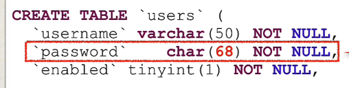
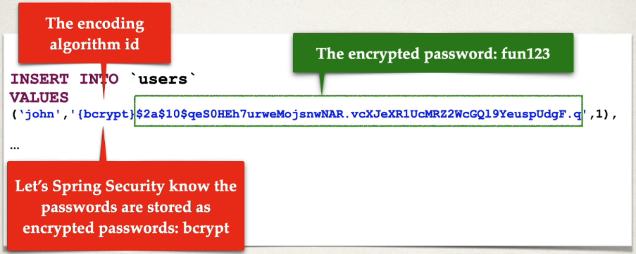

## 278. Spring MVC Security - JDBC Authentication - BCrypt Encryption - Overview Part 2

### Development Process 
1. Run SQL Script that contains encrypted passwords 
   * modify DDL for password field, length should be 68 
THAT'S IT, no need to change Java souce code 

#### Spring Security Password Storage 
* In spring security , passwrods are stored using a specific format 
  * `{bcrypte}encodedPassword`
    * bcrypte - 8 chars 
    * encodedPassword - 60 chars 

####  Modify the DDL for password field : 

##### Step 1 : develop SQL Script to setup database tables 

#### Spring Security Login Process 
1. retrieve password from db for the user 
2. read the encoding algorithm id (bcrypt etc) 
3. for case of bcrypt , encrypt plaintext password from login form (using salt from db passwrod)
4. Compare encrypted password from login form WITH encrypted password from db 
5. if there is match , login successful 
6. if no match , login NOT successful 

