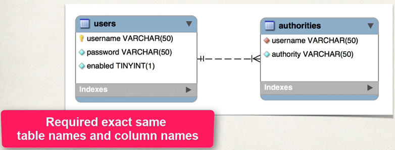
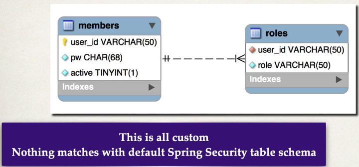

## 280. Spring MVC Security - JDBC Authentication - Custom Tables - Overview

#### Default Spring Security Database Schema 


#### Custom Tables 
* what is we have our own custom tables ? 
* our own custom column names ? 

#### For Security Schema Customization 
* Tell spring how to query your custom tables  
* provide query to find user by username 
* provide query to find authorities / roles by username

### Development Process 
1. Creat our custom tables with SQL 
2. Update Spring Security Configuration 
   * Provide query to find user by user name 
   * Provide query fo find authorities / roles by user name 

#### Step 1: Create custom tables iwth SQL : 


#### Step 2: Update Spring Security Configuration 
```java
theUserDetailsManager
        .setUsersByUsernameQuery("select user_id, pw, active from memberes where user_id=?");
theUserDetailsManager
        .setAuthoritiesByUsernameQuery("select user_id, role from roles where user_id=?")
```
 