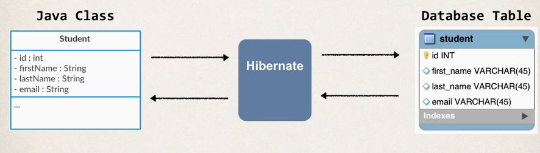

## 285. JPA / Hibernate Advanced Mappings Overview - Part 1

### Basic Mapping 

### Advanced Mapping 
* in the database, you most likeyly will have 
  * multiple tables 
  * relationships between Tables 
* Need to model this with Hibernate 

#### Types of Advanced Mapping 
* one-to-one
* one-toMany, Many-to-One
* Many-to-Many 

#### one-to-one Mapping 
* an instructor can have an "instructor detail" entity 
  * similar to an "instructor profile"

#### one-toMany
* an instructor can have many courses 

Many-to-Many mapping 
* a course can have many students 
* a student can have many courses 
* 

