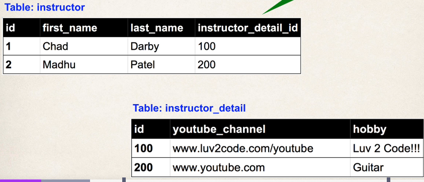
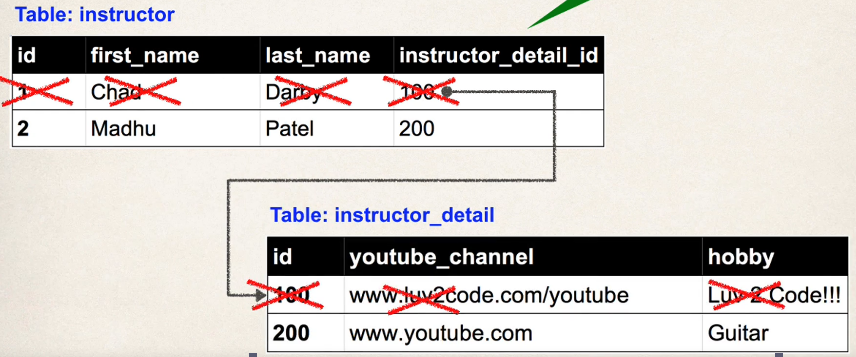

## 286. JPA / Hibernate Advanced Mappings Overview - Part 2

### Important Database concepts 
* primary key and foreign key 
* Cascade 

#### primary key and foreign key 
* Primary key: identify a unique row in a table 
* Foreign key : 
  * link tables together 
  * a field in one table that refers to primary key in another table 
* 

#### Cascade
* You can cascade operations 
* apply the same operation to related entities 
* for example 
  * we have `instructor` and `instructor detail` detail entities 
    * when save the `instructor` the `instructor detail` will be saved automatically 
    * if we delete `instructor` , it will delete `instructor detail`
    * 

##### Cascade Delete 
* Cascade delete depends on the use case 
* in case of **many-to-many** 
  * should we do cascade delete here ???
  * **NO way !!!!!** 
  * as `Developer` can configure the cascading 

#### Fetch Types : Eager vs Lazy Loading : 
* When we fetch/retrieve data, should we retrieve EVERYTHING? 
  * Eager : will retrieve everything 
  * Lazy will retrieve on request 
* for example : instructor has courses
  * should I get all the courses immediately , or on request ? 

#### Uni-Directional 
* instructor -> instructor detail

#### Bi-Directional 
* instructor -> instructor detail
* instructor <- instructor detail
