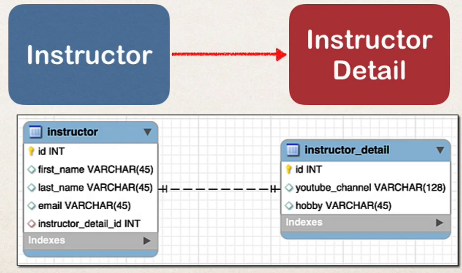
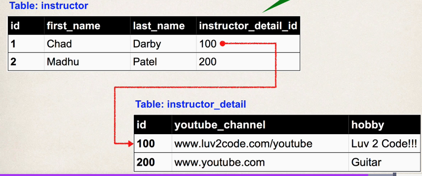

## 287. @OneToOne Mapping Overview - Part 1

### One-to-One Mapping 

* an instrcutor can have an "instructor detail" entity 
  * similar to an `instructor profile`
  * 


#### Uni-Directional 
Instructor -> Instructor detail 

### Development Process : One-to-One 
1. prep work - define database tables 
2. create instructorDetail class
3. create instructor class
4. create main app 

#### table : instructor_detail 
fields :
* id int(11)
* youtube_channelg varchar(128)
* hobby varchar(45)

```mysql
CREATE TABLE `instructor_deail`
(
  `id`              int(11) NOT NUMM AUTO_INCREMENT,
  `youtube_channel` varchar(128) DEFAULT NULL,
  `hoppy`           varchar(45)  DEFAULT NULL,
  PRIMARY KEY (`id`)
    CONSTRAINT `FK_DETAIL` FOREIGN_KEY(`instructor_detail_id`)
    REFERENCES `instructor_detail`(`id`)
); 
```

#### table : instructor
fields : 
* id
* first_name
* last_name
* email
* instructor_detail_id 

```mysql
CREATE TABLE `instructor`
(
  `id`                   int(11) NOT NULL AUTO_INCREMENT,
  `first_name`           varchar(45) DEFAULT NULL,
  `last_name`            varchar(45) DEFAULT NULL,
  `email`                varchar(45) DEFAULT NULL,
  `instructor_detail_id` int(11)     DEFAULT NULL
    PRIMARY KEY (`id`)
    
); 
```
##### Foreign Key 
* link tables together 
* a field in one table that referes to primary key in another table 
* example :  

* Defining foreign key : 
```mysql
CREATE TABLE `instructor_deail`
(
# .....
    CONSTRAINT `FK_DETAIL` FOREIGN_KEY(`instructor_detail_id`)
    REFERENCES `instructor_detail`(`id`)
); 
```

##### More on Foreign Key 
* Main purpose is to preserve relationship between tables 
  * Referential integrity 
* prevents operations that would destroy relationship
* Ensures only valid data is inserted into the foreign key column 
  * Can only contain valid reference to primary key in other table 
  * 