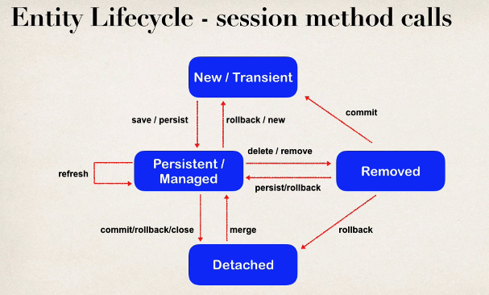

## 288. @OneToOne Mapping Overview - Part 2

### Development Process 

2. Create instructorDetail class 
3. create  instructor class 
4. create main app 

#### Step 2. Create `InstructorDetail` class 
```java
@Entity
@Table(name="instructor-detail")
public class InstructorDetail {
    
    @Id 
    @GenerateValue(strategy=GenerationType.IDENTITY)
    @Column(name="id")
    private int id; 
    
    @Column(name="youtube_channel")
    private String youtubeChannel; 
    
    @Column(name="hobby")
    private String hobby; 
    
    // constructors 
    
    // getters / setters 
    
}
```
#### Step 3 : Creat eINstructor class 
```java
@Entity 
@Table(name="instructor")
public class Instructor {
    
    @Id 
    @GeneratedValue(strategyGenerationType.IDENTITY)
    @Column(name="id")
    private int id; 
    
    @Column(name="first_name")
    private String firstName; 
    
    @Column(name="last_name")
    private String lastName;
    
    @Column(name="email")
    private String email; 
    
    //constructors , getters / setters 
    
}
```
* now we have to independent classes, but still haven't MAPPED LINKED these entities 
* so here to create the relation
```java
@Entity 
@Table(name="instructor")
public class Instructor {
    //     .....
    @OneToOne
    @JoinColumn(name="instructor_detail_id")
    private InstructorDetail instructorDetail;

    //constructors , getters / setters
}
```
* inform hibernate that there is a foreign key in `instructor` table 


### Entity Lifecycle 
* before learning about cascade types, we need to learn about **entity life cycle** 

| operations | Description                                                                       | 
|------------|-----------------------------------------------------------------------------------|
| Detach     | if entity is detached, it is not associated with a Hibernate session              |
| Merge      | if instance is detached from session, then merge will reattach to session         |
| Persist    | Transition new instances to managed state, next flush / commit will save in db    |
| remove     | transitions managed entity to be removed. Next flush / commit will delete from db |
| Refresh    | REload / synch object with data drom db. Prevents stale date                      |
* entity life cycle : is set of states that hibernate entity can go throw when using it in application 
* **stale data** : having different data in memory from the db 
* 


### Cascade : 
* Recall: You can cascade operations 
* Apply the same operation to related entities 
* 

In Hibernate (and JPA), the **entity lifecycle** refers to the various **states** an entity instance can go through during its interaction with the **persistence context** and the **database**.

There are **4 main states** in the entity lifecycle:

---

### ✅ 1. **Transient**

* The entity is **not associated** with any persistence context.
* It is just a **normal Java object** (POJO).
* Not saved in the database yet.
* No database row corresponds to this object.

```java
User user = new User(); // Transient
user.setName("Ali");
```

---

### ✅ 2. **Persistent**

* The entity is **managed by Hibernate** (attached to a session/persistence context).
* Any changes to the object will be **automatically tracked and synchronized** with the database.
* It has a corresponding row in the database (or will be inserted when the transaction is committed).

```java
session.save(user); // Now the user is Persistent
```

---

### ✅ 3. **Detached**

* The entity **was persistent**, but the Hibernate session is now **closed** or the object is **evicted**.
* It is **no longer managed** by Hibernate.
* You can still access and modify the object, but changes **won’t be synchronized** with the database unless you reattach it.

```java
session.close(); // Now user is Detached
user.setName("Mohammad"); // Will not be tracked
```

---

### ✅ 4. **Removed**

* The entity is **marked for deletion** from the database.
* It is still in the persistence context, but it will be deleted when the transaction is committed.

```java
session.remove(user); // Marked for removal
```

---

### 🔄 Lifecycle Diagram (Simplified Flow):

```
         Transient
             |
     session.save()
             ↓
         Persistent
        /        \
   close()     session.remove()
     ↓               ↓
  Detached         Removed
```

---

### 💡 Extra Notes:

* `merge()` is used to reattach a **detached** entity to a session.
* `persist()` is similar to `save()`, but `persist()` doesn't return the generated ID and is more JPA-compliant.
* Hibernate synchronizes changes at **flush** or **transaction commit**.

---

Let me know if you'd like code examples or want to test the lifecycle in a small project.

### cascade : 
In Hibernate (and JPA), **cascade** refers to the automatic **propagation of operations** (like `persist`, `merge`, `remove`, etc.) from a **parent entity to its related child entities**.

---

### ✅ Why Cascade?

When two entities have a **relationship** (e.g., `@OneToMany`, `@ManyToOne`, etc.), you might want to **automatically apply certain actions** to the child entity when performing that action on the parent.

---

### ✅ Common Cascade Types

Hibernate supports these **cascade types** via `CascadeType` enum:

| Cascade Type | Description                                                              |
| ------------ | ------------------------------------------------------------------------ |
| `PERSIST`    | When you save the parent, the child is also saved.                       |
| `MERGE`      | When you merge the parent, the child is also merged.                     |
| `REMOVE`     | When you delete the parent, the child is also deleted.                   |
| `REFRESH`    | When you refresh the parent, the child is also refreshed.                |
| `DETACH`     | When you detach the parent from the session, the child is also detached. |
| `ALL`        | Applies all of the above.                                                |

---

### ✅ Example

#### 👨‍👩‍👧 Parent–Child Example

```java
@Entity
public class User {
    @Id
    @GeneratedValue
    private Long id;

    private String name;

    @OneToMany(mappedBy = "user", cascade = CascadeType.ALL) // <- cascade here
    private List<Post> posts = new ArrayList<>();
}
```

```java
@Entity
public class Post {
    @Id
    @GeneratedValue
    private Long id;

    private String title;

    @ManyToOne
    @JoinColumn(name = "user_id")
    private User user;
}
```

#### Usage:

```java
User user = new User();
user.setName("Mohammad");

Post post1 = new Post();
post1.setTitle("First post");
post1.setUser(user);

user.getPosts().add(post1);

session.save(user); // Because of cascade, post1 is also saved automatically
```

Without cascade, you'd have to save the post manually:

```java
session.save(post1);
```

---

### 🚫 Be Careful with CascadeType.REMOVE

If you use `CascadeType.REMOVE`, deleting the parent will **also delete all children**. This may cause **accidental data loss** if not intended.

---

### ✅ Summary

| Without Cascade                  | With Cascade                                        |
| -------------------------------- | --------------------------------------------------- |
| Save parent, then child manually | Save parent → child is saved automatically          |
| Remove parent only               | Remove parent → child also removed (if cascade set) |

---

Let me know if you’d like a diagram or code demo for it!
