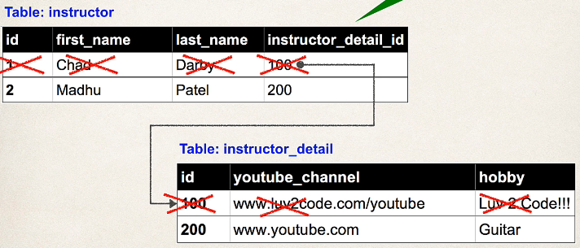
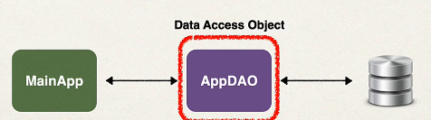

## 289. @OneToOne Mapping Overview - Part 3

### Cascade Delete 


#### OneToOne - Cascade Types : 
| Cascade Type | Description                                                                                 |
|--------------|---------------------------------------------------------------------------------------------|
| PERSIST      | if entity is persisted / saved, related entity will also be persisted                       |
| REMOVE       | if entity is removed / deleted, related entity will also be deleted                         |
| Refresh      | if entity is refreshed, related entity will also  be refreshed                              |
| DETACH       | if entity is detached (not associated w/ session), then related entity will also be detached |
| MERGE        | if entity is merged, then related entity will also be merged                                |
| ALL          | All of above cascade types                                                                  |


#### Configure Cascade Type 
```java
@Entity
@Table(name="instructor")
public class Instructor {
    //     .....
    
    @OneToOne(cascade=CascadeType.ALL) // select the cascade type 
    @JoinColumn(name="instructor_detail_id")
    private InstructorDetail instructorDetail;

    //constructors , getters / setters
}
```

#### Configure Multiple Cascade Types 
```java
@Entity
@Table(name="instructor")
public class Instructor {
    //     .....
    
    @OneToOne(cascade={CascadeType.DETACH,
            CascadeType.MERGE,
            CascadeType.PERSIST,
            CascadeType.REFRESH,
            CascadeType.REMOVE,
    }) // select the cascade type 
    @JoinColumn(name="instructor_detail_id")
    private InstructorDetail instructorDetail;

    //constructors , getters / setters
}
```

#### Step 4 - Creating Spring Boot - Command Line App
* We will create a Spring Boot - Command Line App
* This will allow us to focus on JPA / Hibernate 
* Leverage our DAO pattern as in previous videos 
* 

#### Define DAO interface 
```java
public interface AppDAO {
    
    void save(Instructor theInstructor); 
    
}
```

#### Define DAO implementation 
```java
public class AppDAOImpl implements AppDAO {
    // define field for entity manager 
    private EntityManager entityManager; 
    
    // inject entity manager using constructor injection 
    @Autowired
    public AppDAOImpl(EntityManager entityManager) {
        this.entityManager = entityManager; 
    }
    
    @Override 
    @Transactional 
    public void save(Instructor theInstructor) {
        entityManager.persist(theInstructor); 
    }
}
```
```java
entityManager.persist(theInstructor);
```
* this will also save the `InstructorDetail` Object 

#### Update main app 
```java
@SpringBootApplication 
public class MainApplication {
    public static void main(String[] args) {
        SpringApplication.run(MainApplication.class, args); 
    }
    
    @Bean
    public CommandLineRunner commandLineRunner(AppDAO appDAO) {
        return runner -> {
            
            createInstructor(appDAO); 
        }
    }
    
    private void create Instructor(AppDAO appDAO) {
        
        // creat ethe instructor 
        Instructor tempInstructor = new Instructor("Chad", "Darby", "Chad@luv2code.com"); 
        
        // creat ethe instructor detail 
        InsctorDetail tempInstructorDetail = new InstructorDetail(
                "youtube/chad",
                "luv 2 code"
        );
        
        // associate the objects 
        tempInstructor.setInstructorDetail(tempInstructorDetail); 
        
        // save the instructor 
        System.out.println("Saving instructor : " + tempInstructor);
        appDAO.save(tempInstructor);

        System.out.println("Done!");
    }
}
```
`appDAO.save(tempInstructor);`
* Remember : 
  * this will also save the details object 
  * becuase of CascadeType.ALL
  * in AppDAO , delegated to entityManager.persist(); 
