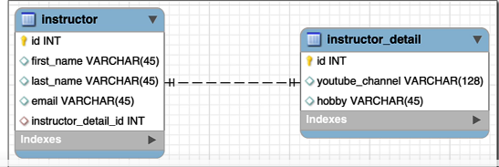

## 290. @OneToOne Mapping - Database Setup

### Run database scripts to create the tables 

### the process 
1. download the starter file from "resources"
2. in the folder has number of sub folders, other files used in later videos 
3. in `dev-spring-boot` 
   * create new directory `09-spring-boot-jpa-advanced-mappings`
4. open pgAdmin 
5. run the sql scripts 
   * open the script `hb-01`
   * the scripts has 
   * create tables `insstructor` , `instructor_detail`
   6. display the diagrams