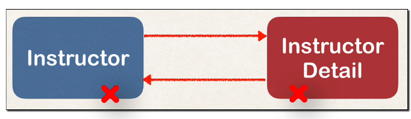

## 303. @OneToOneMapping - Bi-Directional - Cascade Delete - Coding



### the process
1. oepn the `AppDAO` interface
```java
void deleteInstructorDetailById(int theId); 
```
2. open the `AppDAOImpl`
```java
@Override
@Transactional
public void deleteInstructorDetailById(int theId) {
    InstructorDetail theDetail = entityManager.find(InstructorDetail.class, theId);
    entityManager.remove(theDetail);
}
```
3. move to our main application 
    * delete the instructordetail with id = 2 ; 
4. verify the information in database 
5. run the application 
