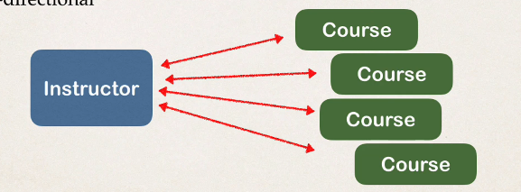
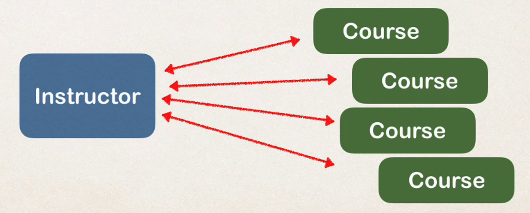
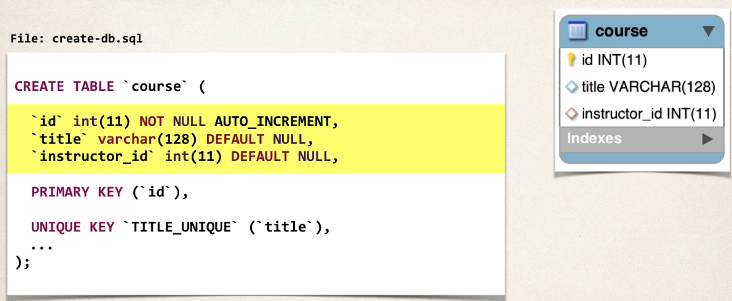
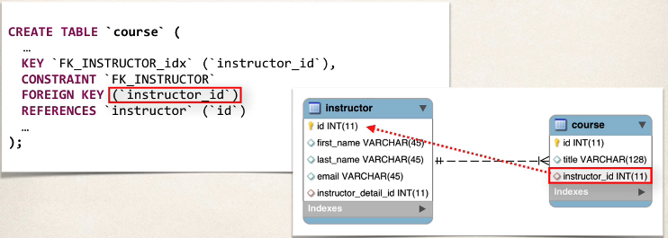
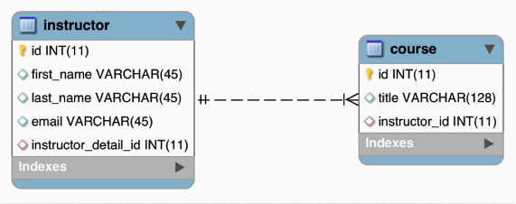

## 305. @OneToMany - Overview - Part 1

### One - to - Many Mapping 

* An instructor can have amny courses 
  * Bi-directional
  * 

#### Many-to-One Mapping 
* Many courses can have one instructor 
  * Inverse / opposite of One-to-Many 
  * 

#### Real world project requirement 
* If you delete an instructor, DO NOT delete the courses 
* If you delete a course, DO NOT delete the instructor
* **Do not apply cascading deletes!** 

#### Development Process : One-to-Many 
1. Prep work - define database tables 
2. Create Course class 
3. Update instructor class 
4. Create Main app 

##### Table : course 


##### Table : course - foreign key 


##### Table : instructor - no changes :


#### Step 2 : Create course class  
@ManyToOne
```java
@Entity 
@Table(name="course")
public class table {
    @Id 
    @GeneratedValue(strategy=GenerationType.IDENTITY) 
    @Column(name="id")
    private int id; 
    
    @Column(name="title")
    private string title; 
    
    @ManyToOne
    @JoinColumn(name="instructor_id")
    private Instructor instructor;
}
```
