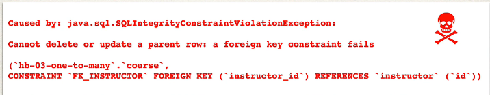

## 324. @OneToMany - Delete Instructor

### Delete Instructor 
* find an instructor by ID 
* Break association of all instructor's courses
* Delete the instructor 

#### Add new DAO method to delete instructor 
```java
// retrieve the instructor 
Instructor instructor = findInstructorById(theId);
// get the courses 
List <Course> courses = instructor.getCourses();

// break the association 
for (Course tempCourse : courses) {
        tempCourse.setInstructor(null);
}

// delete the instructor 
entityManager.remove(instructor);
```

##### Error message : 
* if you don't remove instructor from courses ... constraint violation 


#### Main App 
```java
private deleteInstructor(AppDAO theAppDAO); 
```

### The prcoess code 
1. add the method in DAO 
2. implement the method 
3. call in main app 
4. 