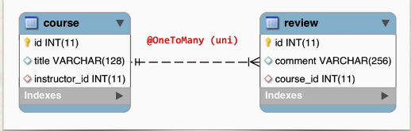
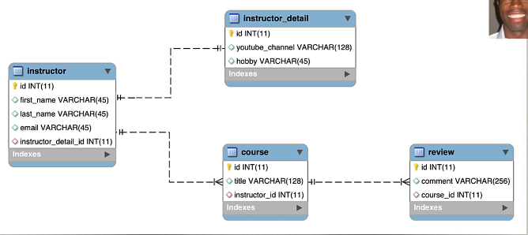

## 326. @OneToMany - Uni-Directional - Overview

### One to Many Mapping 
* A course can have many reviews 
  * uni-directional 

#### Real world project requirement 
* if you delete a course, also  delete the reviews 
* reviews without a course. ... have no meaning 

#### OneToMany 


### Our Project 


#### Development Process : One-to-Many
1. Prep work - define database tables 
2. Create Review class 
3. Update Course class 

#### table : review 
* columns : id, comment , course_id 
* foreign key : course_id 

#### Step 2: Create Review class 
```java
public class Review { 
    private int id;
    private String comment; 
    private Course course;
    
    // constructor 
    
    // setters / getters /
    //... 
}
```

#### Step 3 : update the course reference 
```java
public class Course { 
    // .....
    private List<Review> reviews;
    // ....
}
```
##### Add @OneToMany annotation 
```java
public class Course { 
    // .....
    @OneToMany(fetch=FetchType.LAZY, cascade = CascadeType.ALL)
    @JoinColumn(name = "course_id")
    private List<Review> reviews;
    // ....
}
```
##### @JoinColumn
* in this scenario, @JoinColumn tells Hiberante 
  * Look at the course_id column in the review table 
  * Use this information to help find associated reviews for a course. 

