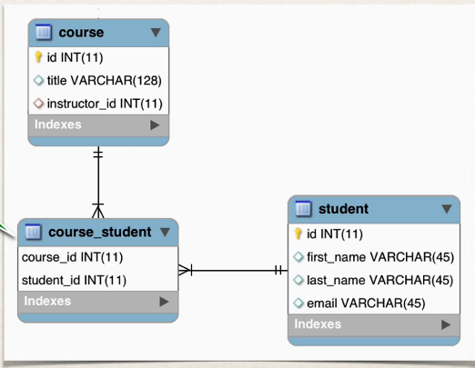
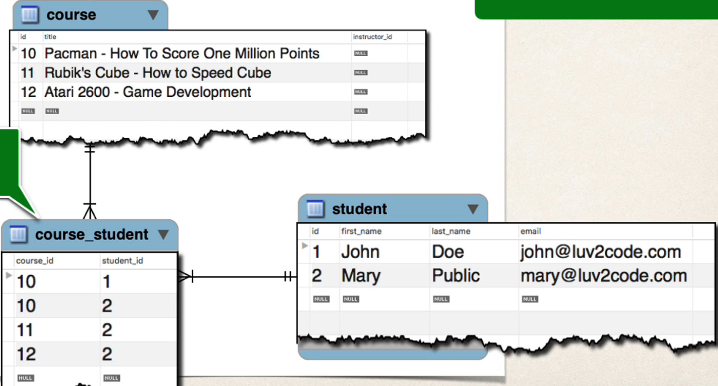
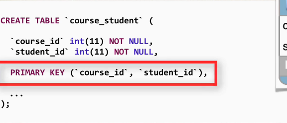
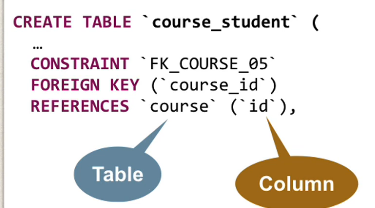

## 333. @ManyToMany - Overview - Part 1

### Many-to-Many Mapping 
* A `course` can have many `students` 
* A `student` can have many `courses` 

Keep track of relationships 
* Need to track which student is in which course and vice versa
* we can use `joined table`

#### Join table 
a table that provides a mapping between two tables.  
if has foreign keys for each table  
to define the mapping relationship  

#### @ManyToMany 

* look at the join table 

#### Join table example : 


### Development Process: Many-to-Many 
1. prep work - Define database tables 
2. update course class 
3. update student class 

#### join table:course_student 


##### foreign keys : 


#### Step 2: Update course - reference students 
```java
@ManyToMany
@JoinTable(
        name="course_student",
        joinColumns=@JoinColumn(name="course_id"),
        inverseJoinColumns=@JoinColumn(name="student_id")
)
private List<Student> students ; 
```

##### More @JoinTable 
* `@JoinTable` tells hibernate 
  * look at the `course_id` column in the `course_student` table 
  * For other side(inverse), look at the `student_id` column in the `course_student` table
  * use this information to find relationship between **course** and **students** 

##### More on inverse 
* in this context , we are finding the relationship in the **Course** class
* The **Student** class is one the "other side" ... so it is considered the "inverse" 
* "Inverse" refers to the "other side" of the relationshiop 

### Owning side and inverse / non owning side 
* every many-to-many association has two sides: 
  * The owning side and the inverse / non-owning side 
* If the association is bidirectional 
  * Either side may be desgined as the owning side 
  * The non-owning side must use the **mappedBy** element of the **ManyToMany** annotaiton 
    * To specify the relation field or property of owning side 

#### Lets update the mapping of the student 
```java
@ManyToMany(mappedBy="students")
private List<Course> courses;

```

##### More mappedBy
```java
public class Student {

    @ManyToMany(mappedBy="students")
    private List<Course> courses;
}
```
* mappedBy tells Hiberante 
  * look at the `student` property in the `course` class 
  * use information from the `Course` class `@JoinTable`
  * to ehlp find associated course for student 

### Real world project
* if you delete a course, DO NOT delete the students 
* in the next set of videos, we'll add support for other features 
* **Lazy Loading** of students and courses 
* **Cascading** to handle cascading save ... but NOT deletes 
  * if we delete a course DO NOT delete studetns 
  * if we delete a student, DO NOT delete courses 
